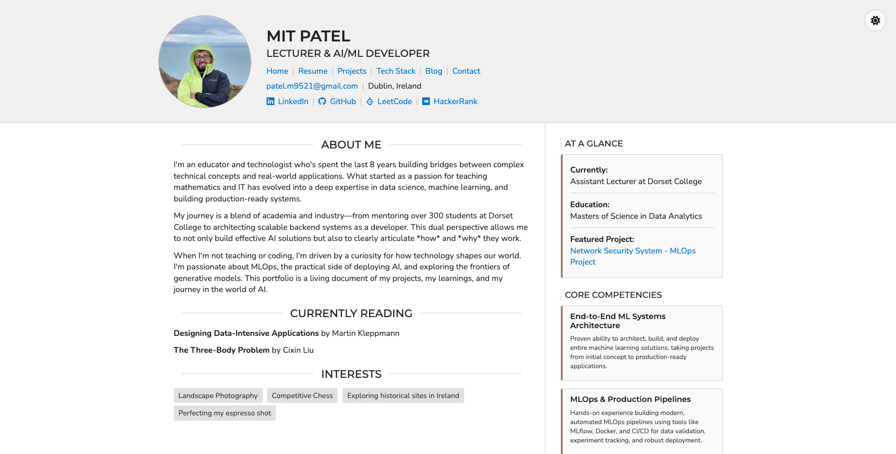

# My Personal Portfolio & Blog



This repository contains the complete source code and content for my personal portfolio website, built by Mit Patel. It's a fully static site generated using Python, Jinja2, and a custom build script, designed to be a living document of my projects, skills, and technical learnings. 

The entire site is generated from a single, centralized JSON database (`portfolio-mit_v1.json`), making it incredibly easy to maintain and update.

**Live Site:** [gojo-rika.github.io](https://gojo-rika.github.io/)

---

## About This Project

The primary goal of this project was to create a clean, professional, and maintainable portfolio that goes beyond a simple resume. I wanted a platform to tell the detailed stories behind my projects and showcase my skills in a visually engaging way.

The core architectural choice was to use a **static site generator** approach. Instead of using a complex framework like React or a CMS like WordPress, I wrote a custom Python script that acts as a build tool. This script reads all my personal and project data from a central JSON file and uses the Jinja2 templating engine to inject this data into HTML templates, generating the final static website.

This approach gives me the best of both worlds:
*   **Ultimate Control:** Full control over every line of HTML and CSS.
*   **Easy Maintenance:** To add a new project or blog post, I only need to update the JSON and Markdown files and re-run the script. No HTML editing is required.
*   **High Performance:** The final output is pure, lightweight static files, which are incredibly fast, secure, and can be hosted for free on platforms like GitHub Pages.


---

## Features

This portfolio is packed with features we've built from the ground up:

*   **Centralized Data Management:** All content (project details, blog posts, skills, etc.) is managed in a single `updated-data.json` file, acting as a "single source of truth."
*   **Dynamic Site Generation:** A Python script (`generate_portfolio_modified.py`) serves as the build engine.
*   **Multi-Page Architecture:** Includes separate, fully-featured pages for:
    *   **Homepage:** A personal introduction and high-level summary.
    *   **Resume:** A clean, professional resume layout.
    *   **Projects:** A beautiful, card-based gallery of my featured work.
    *   **Tech Stack:** A visual grid of all the technologies I'm proficient in.
    *   **Blog:** A filterable list of all my technical articles.
    *   **Contact:** A clear call-to-action page.
*   **Markdown-Powered Blog:**
    *   Blog posts are written in simple Markdown files.
    *   The build script automatically converts them to styled HTML pages.
    *   Supports multi-part blog series with automatic "Part 1 / Part 2" linking.
    *   Includes "Previous/Next Post" navigation to encourage reader engagement.
*   **Interactive UI & UX:**
    *   **Light/Dark Theme Toggle:** A site-wide, persistent theme switcher with a floating icon.
    *   **Themed Icons:** All SVG icons (for social links and tech stacks) are theme-aware, automatically changing color to match the light or dark mode.
    *   **Interactive Filtering:** The blog page features a sidebar that allows users to filter posts by core technologies.
    *   **Responsive Design:** Custom CSS ensures the site looks great on both desktop and mobile devices.
*   **Deep Project-Blog Integration:** Each project card on the "Projects" page links directly to its corresponding detailed "Read the Story" blog post, creating a powerful narrative flow.

---

## How to Run This Project Locally (using `uv`)

1.  **Clone the repository:**
    ```bash
    git clone https://github.com/GoJo-Rika/GoJo-Rika.github.io.git
    cd GoJo-Rika.github.io
    ```

2.  **Install `uv` (if you haven't already):**
    ```bash
    # On macOS / Linux
    curl -LsSf https://astral.sh/uv/install.sh | sh
    
    # On Windows
    irm https://astral.sh/uv/install.ps1 | iex
    ```

3.  **Create and activate a virtual environment using `uv`:**
    ```bash
    uv venv
    source .venv/bin/activate  # On Windows, use `.venv\Scripts\activate`
    ```

4.  **Install dependencies using `uv`:**
    ```bash
    uv pip install -r requirements.txt
    ```

5.  **Run the generator script:**
    ```bash
    python generate_portfolio_modified.py
    ```

6.  **View the site:** Open any of the generated `.html` files (like `index.html`) in your browser.

---

## Future Roadmap & To-Do List

This project is a continuous work in progress. Here are some of the features and improvements planned for the future:

*   `[ ]` **Add a "Copy Code" Button to Code Blocks:** A final layer of polish for the blog, allowing visitors to easily copy code snippets. This was attempted but postponed due to complexities with Prism.js plugin interactions. The plan is to revisit this with a more robust library or custom implementation.

*   `[ ]` **Integrate a CSS Framework (e.g., Bootstrap):** To further improve the responsive design and accelerate the addition of new UI components, I plan to refactor the custom CSS to use a professional framework. This will involve updating the HTML templates to use the framework's class system.

*   `[ ]` **Implement a Direct Contact Form:** To provide an alternative to the `mailto:` link, I plan to integrate a third-party service (like Formspree) to handle direct message submissions from a form on the contact page. This will require setting up the service and adding a `<form>` element to the `contact_template.html`.

*   `[ ]` **Add Search Functionality:** Implement a client-side search feature (using JavaScript) to allow users to search for keywords across all blog posts.

*   `[ ]` **Content Expansion:**
    *   Add more projects to the `json` file.
    *   Write more technical blog posts.
    *   Continue to expand and refine the `tech_stack` with new skills.