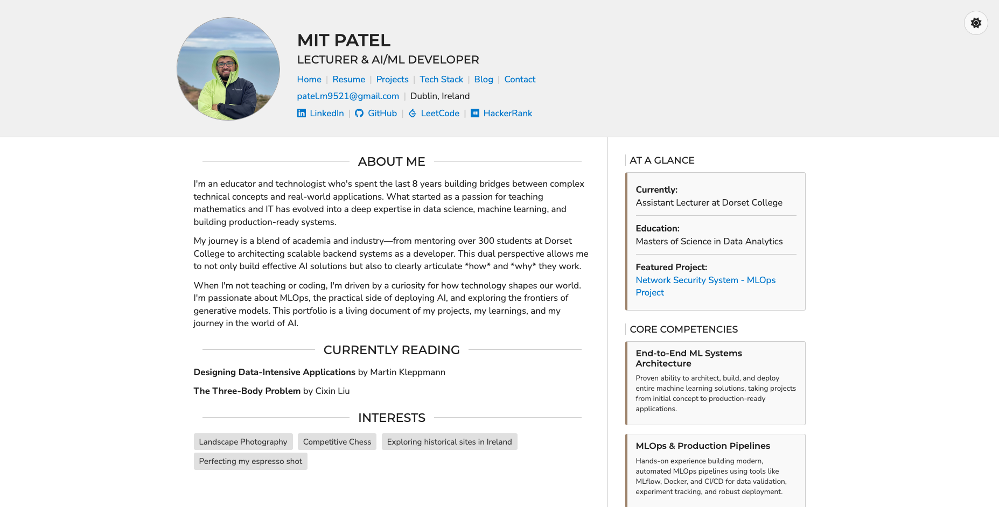

# My Personal Portfolio & Blog



This repository contains the complete source code and content for my personal portfolio website, built by Mit Patel. It's a fully static site generated using Python, Jinja2, and a custom build script, designed to be a living document of my projects, skills, and technical learnings. 

The entire site is generated from a single, centralized [`portfolio.json`](portfolio.json) database, making it incredibly easy to maintain and update.

**Live Site:** [gojo-rika.github.io](https://gojo-rika.github.io/)

---

## About This Project

The primary goal of this project was to create a clean, professional, and maintainable portfolio that goes beyond a simple resume. I wanted a platform to tell the detailed stories behind my projects and showcase my skills in a visually engaging way.

The core architectural choice was to use a **static site generator** approach. Instead of using a complex framework like React or a CMS like WordPress, I wrote a custom Python script that acts as a build tool. This script reads all my personal and project data from a central JSON file and uses the Jinja2 templating engine to inject this data into HTML templates, generating the final static website.

This approach gives me the best of both worlds:
*   **Ultimate Control:** Full control over every line of HTML and CSS.
*   **Easy Maintenance:** To add a new project or blog post, I only need to update the JSON and Markdown files and re-run the script. No HTML editing is required.
*   **High Performance:** The final output is pure, lightweight static files, which are incredibly fast, secure, and can be hosted for free on platforms like GitHub Pages.

---

## Features

This portfolio is packed with features built from the ground up:

*   **Centralized Data Management:** All content (project details, blog posts, skills, etc.) is managed in a single [`portfolio.json`](portfolio.json) file, acting as a "single source of truth." Projects and their associated blogs are grouped together under `projects_blog_db` — one place to update a GitHub URL, image, or summary.
*   **Dynamic Site Generation:** A Python script ([`generate_portfolio_modified.py`](generate_portfolio_modified.py)) serves as the build engine, deriving `featured_projects`, `projects`, and `blogs` lists at runtime from the unified database.
*   **Multi-Page Architecture:** Includes separate, fully-featured pages for:
    *   **Homepage:** A personal introduction with "About Me" prose and an "At a Glance" sidebar.
    *   **Resume:** A clean, professional resume layout with work experience, education, and technical skills.
    *   **Projects:** A beautiful, card-based gallery of featured work with tech stack icons.
    *   **Tech Stack:** A visual grid of all the technologies I'm proficient in.
    *   **Blog:** A filterable, paginated list of all my technical articles.
    *   **Contact:** A direct contact form with Web3Forms (primary) + Formspree (fallback) plus social link cards.
*   **Markdown-Powered Blog:**
    *   Blog posts are written in simple Markdown files.
    *   The build script automatically converts them to styled HTML pages.
    *   Supports multi-part blog series with automatic "Part 1 / Part 2 / Part 3" linking.
    *   Includes "Previous/Next Post" navigation to encourage reader engagement.
*   **Interactive UI & UX:**
    *   **Light/Dark Theme Toggle:** A site-wide, persistent theme switcher with a floating icon.
    *   **Themed Icons:** All SVG icons (for social links and tech stacks) are theme-aware, automatically changing color to match the light or dark mode.
    *   **Multi-Select OR Filters:** The blog page allows filtering by multiple technologies simultaneously using OR logic.
    *   **Dynamic Post Counter:** The "Total Posts" counter updates in real-time based on active filters.
    *   **Load More Pagination:** Blog posts load incrementally with smooth scroll-to-new-content behavior.
    *   **Mobile Filter Panel:** On small screens, filters collapse into a toggleable icon panel with outside-click-to-close.
    *   **Client-Side Search:** A floating search button (with ⌘K shortcut) opens a modal overlay to search across all blog post titles, summaries, and tags.
    *   **Horizontal Progress Bar:** A reading progress indicator at the top of blog post pages.
    *   **Table of Contents (TOC):** Auto-generated from blog post headings with a collapsible hamburger menu on mobile.
    *   **Sticky Sidebar:** Post metadata and TOC remain fixed while scrolling through content.
    *   **Responsive Design:** Custom CSS ensures the site looks great on both desktop and mobile devices.
*   **SEO & Open Graph:** Auto-generated `meta_description`, `meta_keywords`, and `og:description` for every blog post, plus proper Open Graph tags on all pages.
*   **Sitemap & Robots.txt:** Automatically generated `sitemap.xml` (with all pages and blog posts) and `robots.txt` at build time.
*   **Automated Image Optimization:** The build script converts all images in `project_images/` and `posts_assets/` to WebP format with thumbnails.
*   **Deep Project-Blog Integration:** Each project card on the "Projects" page links directly to its corresponding detailed "Read the Story" blog post.
*   **Dual Contact Form:** A contact form using Web3Forms as the primary endpoint with an automatic Formspree fallback, client-side validation, loading states, success/error toasts, and honeypot anti-spam fields.
*   **CI/CD Pipeline:** A GitHub Actions workflow (`.github/workflows/deploy.yml`) that automatically builds and deploys the site to GitHub Pages on every push to `main`.
*   **Modular Codebase:** All inline CSS and JS has been extracted into dedicated external files (`css/blog.css`, `js/blog.js`, etc.) for improved maintainability and caching.

---

## How to Run This Project Locally (using `uv`)

1.  **Clone the repository:**
    ```bash
    git clone https://github.com/GoJo-Rika/GoJo-Rika.github.io.git
    cd GoJo-Rika.github.io
    ```

2.  **Install `uv` (if you haven't already):**
    ```bash
    # On macOS / Linux
    curl -LsSf https://astral.sh/uv/install.sh | sh
    
    # On Windows
    irm https://astral.sh/uv/install.ps1 | iex
    ```

3.  **Create and activate a virtual environment using `uv`:**
    ```bash
    uv venv
    source .venv/bin/activate  # On Windows, use `.venv\Scripts\activate`
    ```

4.  **Install dependencies using `uv`:**
    ```bash
    uv pip install -r requirements.txt
    ```

5.  **Run the generator script:**
    ```bash
    python generate_portfolio_modified.py
    ```

6.  **View the site:** Open any of the generated `.html` files (like [`index.html`](index.html)) in your browser.

---

## Future Roadmap & To-Do List ---> Total: 22, Completed: 20; 03.04.2026

This project is a continuous work in progress. Here are some of the features and improvements planned for the future:

*   `[ ]` **Update architecture diagram link in markdown file:**
    *   by simply adding `../` or `/` should work on local system, but that does not solve the problem in static `html` page
    *   the current approach solves the issue for `html` page but when previewing the `markdown` file, the **image** is not shown (both in **local** as well as in **github repos**)

*   `[ ]` **Architecture diagram and video or a gif:**
    *   Add architecture diagram of the project or the blog or create a video doing a walkthrough of the project or a gif of the working ui.

*   `[x]` **Add a "Copy Code" Button to Code Blocks:** -- 27.02.2026
    *   A final layer of polish for the blog, allowing visitors to easily copy code snippets. This was originally attempted with Prism.js plugins, but has now been resolved directly using a custom Javascript implementation to sidestep the plugin issues.

*   `[x]` **Add Search Functionality:** -- 27.02.2026
    *   Implemented a client-side search feature using vanilla JavaScript. A search index is auto-generated at build time and a floating search button (with ⌘K shortcut) opens a modal overlay to search across all blog post titles, summaries, and tags.

*   `[x]` **Make changes for 3 blog series:** -- 28.02.2026
    *   If there are 3 blogs which are written, then link them properly and make sure it works.
    *   The current version does not do that (it loops over the middle blog in `Text Summarizer`)

*   `[x]` **Add horizontal progress scroll bar:** -- 06.03.2026
    *   Add horizontal progress scroll bar to the top of the page to make it easier for users to navigate the page.

*   `[x]` **Add dynamic pagination for blog page:** -- 08.03.2026
    *   Add dynamic pagination for blog page to make it easier for users to navigate through the blog posts. --> `Load More Posts` button at the end of the blog page.

*   `[x]` **Add heading sections inside blog post page:** -- 09.03.2026
    *   In the blog post page, add page headings and links for easy scrolling and navigating through the page.

*   `[x]` **Add table of contents in posts page:** -- 09.03.2026
    *   Add table of contents in posts page to make it easier for users to navigate through the blog posts.

*   `[x]` **Modify the code such that the sidebar is fixed in the page while scrolling down (sticky positioning):** -- 09.03.2026
    *   where the sidebar (or an element) remains fixed in place while the rest of the page scrolls—is called "sticky positioning" in web design.

*   `[x]` **Keep 3 projects columns:**
    *   Need to make changes in [`project_template`](projects_template.html) to make sure it includes 3 project cards in each row.

*   `[x]` **Add read story section in project page:**
    *   In the project page, under the given project card, add a link to read the blog along with viewing it on github.

*   `[x]` **Mobile filter panel improvements:** -- 18.03.2026
    *   On mobile, filters collapse into a toggleable icon. The panel closes when clicking outside of it.

*   `[x]` **Load More scroll behavior:** -- 18.03.2026
    *   After clicking "Load More Posts," the viewport automatically scrolls to the first newly loaded post, instead of staying at the bottom.

*   `[x]` **Dynamic "Total Posts" counter:** -- 25.03.2026
    *   The "Total Posts" counter next to "Recent Posts" now updates in real-time based on the number of posts matching the currently selected filters.

*   `[x]` **Multi-select OR filters for blog page:** -- 18.03.2026
    *   Users can select multiple technology tags simultaneously. Filtering uses "OR" logic — posts matching *any* selected tag are shown.

*   `[x]` **Organise data inside `json` file:** -- 27.03.2026
    *   Migrated from scattered `portfolio-mit_v1.json` to a unified [`portfolio.json`](portfolio.json) with a `projects_blog_db` structure.
    *   Blogs inherit `github_url` from their parent project; no more redundant URLs.
    *   Updated `generate_portfolio_modified.py` to derive all template-compatible lists at runtime from the unified database.

*   `[x]` **Implement a Direct Contact Form:** -- 27.03.2026
    *   Integrated dual contact form with Web3Forms (primary, 250/mo limit) + Formspree (fallback, 50/mo limit). Includes client-side validation, loading states, success/error toasts, and honeypot anti-spam fields for both services.

*   `[x]` **Extract inline CSS/JS into external files & clean HTML templates:** -- 03.04.2026
    *   Extracted large `<style>` and `<script>` blocks from all templates into dedicated files (`css/blog.css`, `css/contact.css`, `css/post-layout.css`, `css/projects.css`, `css/tech-stack.css`, `js/blog.js`, `js/contact.js`, `js/post-toc.js`).
    *   Added `trim_blocks=True` and `lstrip_blocks=True` to Jinja2 Environment for cleaner HTML output.
    *   Removed all verbose HTML comments, duplicate script references (resume had app.js loaded 3x), and excess whitespace.

*   `[x]` **Sitemap & Robots.txt Generation:** -- 03.04.2026
    *   Added `generate_sitemap()` and `generate_robots_txt()` functions to the build script.
    *   `sitemap.xml` includes all static pages and blog posts with `lastmod`, `changefreq`, and `priority`.

*   `[x]` **Dynamic SEO & Open Graph Metadata:** -- 03.04.2026
    *   Auto-generates `meta_description` (truncated to 160 chars from post content), `meta_keywords` (from core_technologies + keywords), and `og:description` for every blog post at build time.

*   `[x]` **Automated Image Optimization (WebP):** -- 03.04.2026
    *   Added Pillow-based image optimization to the build script. Converts all `.jpg`/`.png` images in `project_images/` and `posts_assets/` to WebP format (80% quality) with `_thumb.webp` thumbnails (400×400 max). Conversions are incremental — skipped when WebP is already up-to-date.